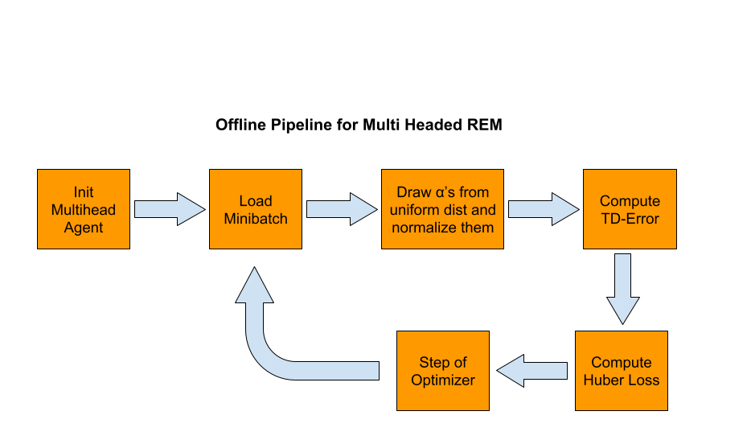

# Progress Log

## Initial Meeting (08.06.2021)

Introduction and discussion of the milestone for the first week and rough plan for the next milestones.

## Meeting Two (14.06.2021)
- Discussion of the pipeline (high level pipeling complete)

- Discussion of modular structure for project pipeline implementation (in progress)

After meeting TODOs:
- [x] Access for all memebers to the AIS Computers
- [x] Location for shared dataset --> see Meeting 3
- [ ] Define experiments we want to conduct in scope of project --> moved to next meeting

## Meeting Three (22.06.2021)
Current state of the project: data processing and training pipeline are coded, commencing a training run is possible. Online validation reward after first training epoch is quite low --> may indicate code needs to be adjusted.

Discussed in meeting:
- Download two game datasets per account
- Hyperparameter of when to switch checkpoints in buffer discussed --> add to experiments

After meeting TODOs:
- [ ] Send out update when rewards start looking promising
- [ ] Checkpoint switching hyperparameter experiment
- [ ] Start looking at which baselines we would like to implement

##  Project Milestone 1 (15.06.2021)
- [x] Read and understand [An Optimistic Perspective on Offline Reinforcement Learning](https://arxiv.org/pdf/1907.04543.pdf)
- [ ] Refresh RL knowledge with [RL Tutorial](https://github.com/andri27-ts/Reinforcement-Learning) and [Offline RL Tutorial Paper](https://arxiv.org/pdf/2005.01643.pdf#cite.kalashnikov2018qtopt)
- [x] Visualize the training pipeline
- [x] Gain Access to the AIS computers
- [x] Share AIS template

##  Project Milestone 2 (29.06.2021)
- [ ] Implementation
    - [ ] Test running the original implementation
    - [x] Visualize a sample of the dataset
    - [x] Code the agent as presented in the paper
    - [x] Code the network as presented in the paper
    - [x] Code the training pipeline
    - [ ] Define experiments for the project
    - [ ] Complete experiments

##  Project Milestone 3 (13.07.2021)
- [ ] Implementation of the other baselines

## Project Experiments 
- [ ] Checkpoint switching hyperparameter

## Submission Final Project (27.07.2021)

## Presentation (03.08.2021)
