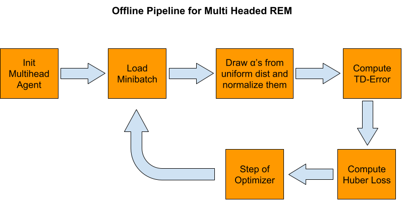

# Progress Log

## Initial Meeting (08.06.2021)

Introduction and discussion of the milestone for the first week and rough plan for the next milestones.

## Meeting Two (14.06.2021)
- Discussion of the pipeline (high level pipeling complete)

- Discussion of modular structure for project pipeline implementation (in progress)

After meeting TODOs:
- [ ] Access for all memebers to the AIS Computers
- [ ] Location for shared dataset
- [ ] Define experiments we want to conduct in scope of project

##  Project Milestone 1 (15.06.2021)
- [x] Read and understand [An Optimistic Perspective on Offline Reinforcement Learning](https://arxiv.org/pdf/1907.04543.pdf)
- [ ] Refresh RL knowledge with [RL Tutorial](https://github.com/andri27-ts/Reinforcement-Learning) and [Offline RL Tutorial Paper](https://arxiv.org/pdf/2005.01643.pdf#cite.kalashnikov2018qtopt)
- [ ] Visualize the training pipeline
- [ ] Gain Access to the AIS computers
- [x] Share AIS template

##  Project Milestone 2 (29.06.2021)
- [ ] Implementation
    - [ ] Test running the original implementation
    - [ ] Visualize a sample of the dataset
    - [ ] Code the agent as presented in the paper
    - [ ] Code the network as presented in the paper
    - [ ] Code the training pipeline
    - [ ] Define experiments for the project
    - [ ] Complete experiments

##  Project Milestone 3 (13.07.2021)
- [ ] Implementation of the other baselines

## Submission Final Project (27.07.2021)

## Presentation (03.08.2021)
